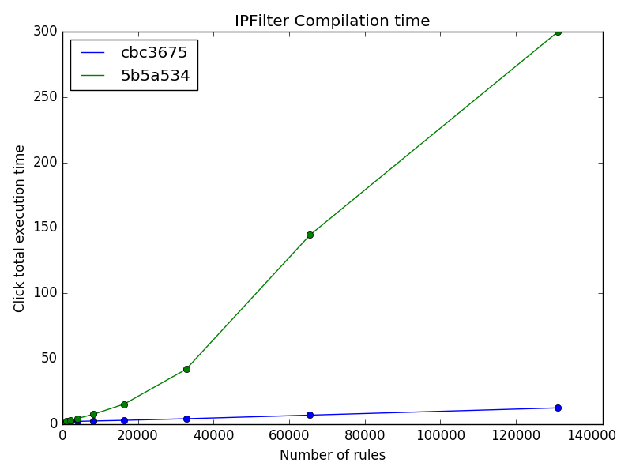
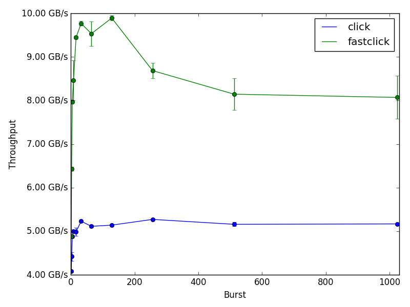
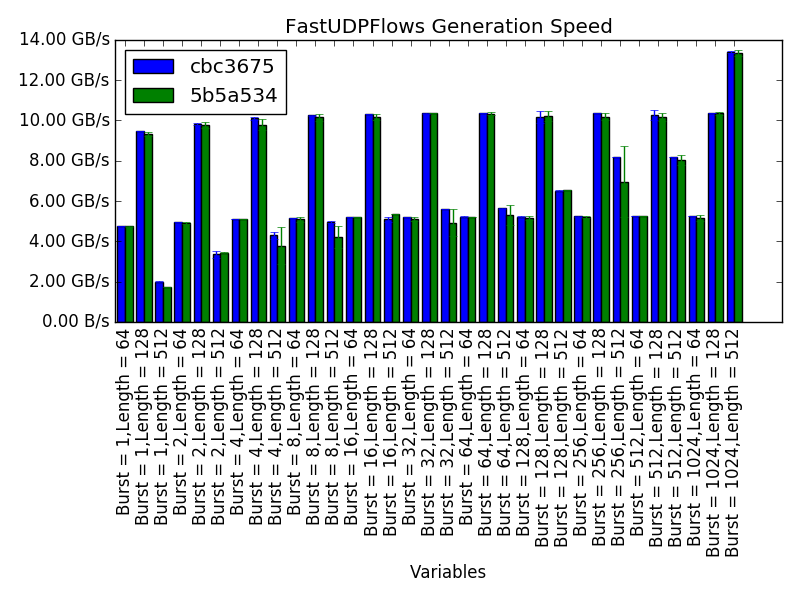

Network Performance Framework
=============================

Run performance tests on Network software 
using
configuration files much like [Click Modular Router](https://github.com/kohler/click/)'s testies but supports any networking software.

Testie files allow to define a matrix of parameters 
to try many combinations of
variables for each test and report performance results and evolution for each
line of the matrix.

Finally, a graph will be built and statistical results computed for each test 
showing the evolution of performances through commits.

Testie files are simple to write, and easy to share, as such we encourage
users to make pull requests, especially to support more software
through repo files and give a few examples testie for each of them.

NPF supports running the given test across a custer, allowing to try your tests in multiple different configuration very quickly and on serious hardware.

### Installation
NPF is built using Python 3

#### Auto
To install python3, pip, and python dependencies you can do
```bash
sudo ./setup.sh
```

#### Manual
To install python 3, pip and required devel headers on ubuntu, use :
```bash
sudo apt-get install python3 python3-pip libssl-dev
```

Then to install python dependencies using pip3, do :
```bash
sudo pip3 install numpy
sudo pip3 install -r requirements.txt
```

## Tools
Three tools come with this performance framework :
  * npf-run.py for advance regression and statistics tests on one repository
  * npf-watch.py to watch one or multiple repositories for any new commit and e-mail regression results in case
of change in performances due to the last commits
  * npf-compare.py to compare one testie but across multiple repository, mainly to compare
how different branches/implementations behaves against each others

### NPF Run
NPF-Run is the main NPF tool.

It checks out or update a given repository (described in the repo
folder), build the software, and launch the given testies

Example :
```bash
    python3 npf-run.py click #Produce a graph for each click-based tests with the result
```

#### Regression
NPF-Run is able to check commit history, do regression test, and graph the performance history
for all testies using the --regress flag.

```bash
    #click master is updated
    python3 npf-run.py click --regress #The graph now compares HEAD and the last commit, if major performances changes are found, the return code will be different than 0
    #click master is updated again
    python3 npf-run.py click --regress #The graph includes the older commit for reference, up to "--graph-num", default is 8
```

Example of a generated graph for the Click Modular Router, just when IPFilter compilation process was re-worked :


Alternatively, you can force npf-run.py to re-build and compute the data for the old runs directly with the --allow-old-build option :
```bash
    python3 npf-run.py click --allow-old-build [--graph-num=8] #Graph the performance of the current version and the last 8 previous ones
```

#### Statistics
NPF-Run can produce statistics about the results such as the best set of variable, the average per-variable,
a regression tree and the importance of each features.

```bash
    python3 npf-run.py click --statistics
```

See *python3 npf-run.py --help* for more options

### NPF Watcher

Watcher is a stripped down version of npf-run.py (without statistics support mostly), but allowing to
loop through a given list of repositories watching for changes. When
a new commit is seen, it will run all given testies and e-mail the results
to a given list of addresses.

```bash
python3 npf-watch.py click fastclick --mail-to tom.barbette@ulg.ac.be --tags fastregression --history 1
```
The arguments are :
 * click fastclick : List of repos to watch, as described in the repos folder
 * --history N allows to re-do the tests for the last N commits, you will receive
 an e-mail for each commits of each repos.
 * --tags TAG1 TAG2 [...] allows to set flags which change variables in the tests, see below.

See *python3 npf-watch.py --help* for more options

### NPF Compare

NPF-Compare allows to do the contrary of npf-run.py : instead of
 testing multiple testies on one repository, it tests one testie across
 multiple repositories.
 
This example allows to compare Click against [FastClick](https://github.com/tbarbette/fastclick/) (a faster version of the Click Modular Router) for the infinitesource
  test case :

```bash
python3 npf-compare.py click fastclick --testie tests/pktgen/infinitesource-01.testie --variables LENGTH=64
```
 * click fastclick : List of repos to compare
 * --testie FILENAME : Testie to test. This argument is available in all tools.
 * --variables  VAR=VAL [...] : Fix the value of one variable.
 By default in this testie, the test is redone with packet length 64,256 and 1024. This
 allows to have one less "dynamic" variables so the grapher can
 use a lineplot instead of a barplot (see below).
 
Result :

Just for relevance, batching is what makes this difference.

This tool has also less options than NPF-Run. You should use NPF-Run
to create your tests and tune parameters for each repository independently.
And then only use npf-compare.py when ready. Compare does not support statistics or regression tests.

See *python3 npf-compare.py --help* for more options

### Which one to use
Use npf-run.py for development, trying big matrices of configuration,
get extended graph and customized tests for each testies.

Use npf-watch.py with the fastregression tags to send you an e-mail automatically
when some new commits introduce performances problems.

Use npf-compare.py to compare multiple repositories, multiples branches or multiple
different softwares. The testies included in this repository support comparing throughput of Click and FastClick in diverse
configurations, or NetPerf and Iperf as packet generators.

### Main common arguments
All tools feature those common arguments :

 * --variables VAR=VAL [VAR2=VAL2 ...] allows to overwrite some testie variables configuration, mainly to reduce the set of parameters
 * --config VAR=VAL [VAR2=VAL2 ...] allows to overwrite some configuration options such as n_runs used to define the number of time a test should be launched for each variable combination
 * --testie path : Path to a folder or a testie. By default "tests" is used.


## Dataset
All results of tests are saved per-commit and per-repo to avoid re-computing the next time
you launch either of the tools. However the set of variables must be exactly the
same.

To force re-computing the tests, use the --force-test option. The --force-rebuild
may also be something you want.


## Tags
All programs have the --tags argument, allowing to give a set of tags
that trigger changes in the testies. The dpdk flags tells that a DPDK
environment is setted up with at least two NICs, allowing DPDK-based
tests to run. The fastregression tag allows to only try important
variable combination and not search for performance points, while full
is the contrary and will run a very big set of variables combinations
to get statistics out of results.


## Writing testie files
See [testies/README.md](testies/README.md) to read more about testies and learn about creating new ones. Testies describe the tests and parameters to re-run them in multiple configuration. Testie are the heart of NPF.

## Repository files
See [repo/README.md](repo/README.md) to lear how to build repository definition files to let NPF know how to fetch and compile some software

## Cluster
Testie files define multiple roles such as "client" or "server". Each role can be mapped
 to a given node to run a test across a cluster using the *--cluster ROLE=NODE [ROLE2=NODE2]* argument.

NPF will run the testie scripts for each role on the mapped cluster. Giving the node address in the
 command line may be enough. However some tests require more information about each node
 that can be set using cluster files. More information about writing cluster files is given in [cluster/README.md](cluster/README.md)

### Graph
Graph are automatically generated for all tested variables
combinations.

To choose the type of graph, the number of dynamic variables is taken into account.

Below, npf-run.py gave two series to the Grapher (current and last commit), while the testie
generate a matrix of Burst and Lengths, that is 2 dynamic variables and only a barplot can render that correctly
as lines would be uncomparable.



If a "previous version" is not given to npf-run.py (so it just runs the test for the current master but do not compare 
the results), the graph will use one variable as the serie as having only one
line would be a loss of space, leaving only one dybamic variable :


The Comparator uses the repositories as series.


### Where to continue from here?
Read the testie files in tests/click mostly, then write your owns !

TODO
----
WIP!!! Looking for collaborators !
